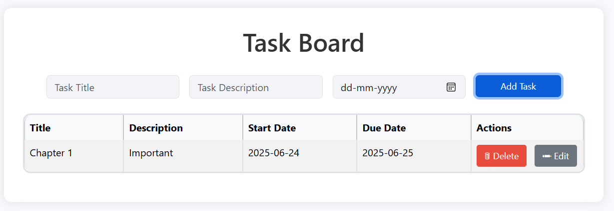

# 📝 Task Board Web App

This is a simple and responsive **Task Management Board** built using **HTML, CSS (Bootstrap)** for the frontend and **Node.js + Express + MongoDB (Compass)** for the backend.

It allows users to create, view, edit, and delete tasks — along with start and due dates for each task.

---

## 🚀 Features

- ✅ Add tasks with title, description, and due date
- ✅ Auto-generated start date (set to today's date)
- ✅ View all tasks in a clean Bootstrap table layout
- ✅ Edit task title, description, and due date
- ✅ Delete individual tasks
- ✅ Clean, modern, and centered UI
- ✅ MongoDB Compass used for local database storage

---

## 🛠️ Tech Stack

| Layer      | Technology               |
|------------|---------------------------|
| Frontend   | HTML, CSS, Bootstrap 5    |
| Backend    | Node.js, Express          |
| Database   | MongoDB (via Mongoose)    |
| Tools      | Git, GitHub, VS Code      |

---

## ⚙️ How It Works

1. **Frontend Form** takes task input (title, description, due date).
2. **JavaScript (Fetch API)** sends data to the backend via POST request.
3. **Node.js + Express** handles the request and stores the task in MongoDB.
4. On load, tasks are fetched from MongoDB and rendered in a table.
5. Edit and Delete buttons make PUT and DELETE requests to update MongoDB.

---

## 📦 How to Run Locally
In Bash run

1. Clone the repo:

git clone https://github.com/Rakesh-Kumar-Talam/Task-Board.git
cd taskboard-project

2. Install dependencies:

npm install

3. Start MongoDB locally (using MongoDB Compass or terminal):

Ensure MongoDB is running on mongodb://localhost:27017/taskboard

4. Start the server:

### for bash
node server.js
### or if using nodemon:
npm run dev

5. Open index.html in your browser.

## 📸 Screenshots

## Test Cases Passed

✅ Task is added only when all fields are filled

✅ Start date auto-fills with today's date

✅ Due date picker works via calendar input

✅ Tasks are listed with correct formatting

✅ Tasks persist in MongoDB across refreshes

✅ Edit updates all fields correctly

✅ Delete removes task immediately

## Future Improvements
1. User authentication

2. Task status toggle (e.g., completed/in-progress)

3. Filter/sort by due date

4. Responsive mobile view enhancements

## 🧑‍💻 Author
T. Rakesh Kumar
Linked In: https://www.linkedin.com/in/rakesh-kumar-28a3552a1?utm_source=share&utm_campaign=share_via&utm_content=profile&utm_medium=android_app
